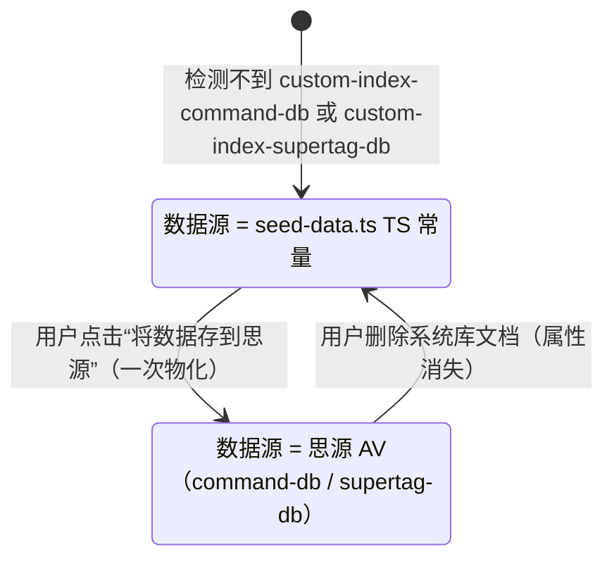

# IndexOS 架构文档

> 本文档描述 siyuan-plugins-index 的核心架构，特别是实验性 IndexOS 系统的数据流。
> 维护约定：改动涉及状态机 / 数据源 / 命名时，必须同步更新本文档。

## 1. 项目定位

思源笔记插件，两部分能力：

- **基础功能**：一键插入目录 / 大纲（顶栏按钮、`⌥⌘I` / `⌥⌘O`）。
- **实验功能（开发者模式）**：IndexOS——命令系统、Supertag（超级标签）绑定、AV 数据库与 SQL 控制台。

## 2. 版本与兼容性约定（重要）

- 当前为**测试版本**。
- **命令管理（IndexOS Command 系统）与 SQL 管理 AV 相关功能不做 backwards compatibility**：
  不保证旧数据 / 旧表结构兼容，不写迁移代码，可以直接破坏性变更。
- 普通目录 / 大纲功能保持稳定。

## 3. 状态机：数据从哪来

规则：

1. **状态判定只看思源可观察事实**：能否同时找到绑定 `custom-index-command-db` 和
   `custom-index-supertag-db` 属性的两张表（属性 → 定位到 AV 两步都成功才算已实例化）。
   不存本地标志，用户删除系统库后自动回到未实例化。
2. 未实例化时，运行时读 [seed-data.ts](/Users/feng/Desktop/项目/思源项目/siyuan-plugins-index/src/features/command/indexos/seed-data.ts)
   的 TS 常量（Layer 2 命令种子 + Layer 3 supertag 种子 + 条件脚本）。
3. 已实例化后，思源 AV 是唯一数据源；**种子常量不再参与任何运行时路径**
   （supertag 触发、命令注入、对话框均不得回退读种子）。
4. 状态与刷新集中在 `sync-service.ts`（`getTargetTablesInfo` / `refreshSupertagRegistry`），
   各消费者不要自己重复判断。

## 4. 分层与命名

| 层 | 内容 | 未实例化 | 已实例化 |
|---|---|---|---|
| Layer 1 | 命令定义（`CommandDef`） | `commands.json` 为源；内存注册表持 executor；`sys_registry_db` 仅为查询镜像 | 同左 |
| Layer 2 | Command-DB 命令编排行（`CommandBinding`） | 读种子 | 读思源 AV |
| Layer 3 | Type-DB supertag 绑定 | 读种子 | 读思源 AV |
| Layer 4 | 每个 supertag 的独立数据库 | 不存在 | 存在于 data-dbs |

命名约定（勿混淆）：

- `CommandDef`：Layer 1 完整命令定义（`command-registry.ts`）。
- `CommandBinding`：Layer 2 一行绑定 `label → commandRef`（`registration.ts` 的 `COMMAND_BINDINGS`）。
- 注册表：`commandRegistry`（Layer 1 单例）≠ `COMMAND_BINDINGS`（Layer 2 内存表）。

## 5. 种子数据规则

- **唯一定义点**：`src/features/command/indexos/seed-data.ts`（TS 常量）。
- **没有 SQLite 种子表**：`sys_command_db` / `sys_type_db` 已删除，禁止重建、禁止在运行时写入。
- 种子只读；实例化是一次性物化（`construct-dir.ts` 读常量 → 写入思源 AV）。
- 未实例化时 supertag 条件脚本由 `getSeedConditionalScript()` 提供。
- Layer 1 注册表每次启动从 `commands.json` 重建（热更新内置命令定义用），这是唯一允许的“重播种”。

## 6. 关键模块地图

- 入口 / 生命周期：`src/index.ts`
- 状态判定 + 注册表刷新：`src/features/command/utils/sync-service.ts`
- 实例化（将数据存到思源）：`src/features/command/construct-dir.ts`
- Layer 1 注册表：`src/features/command/registry/command-registry.ts`
- Layer 2/3 内存状态：`src/features/command/registration.ts`
- 命令调度：`src/features/command/command-dispatcher.ts`
- 超标签触发：`src/features/command/supertag/core/supertag-trigger.ts`
- SQLite 引擎 / AV 镜像：`src/features/sqlite/sqlite-manager.ts`

## 7. 工程约定

- `npx tsc --noEmit` 必须**零错误**（已清理至零，请保持）。
- `npm run build` 必须通过（含 svelte 编译）。
- 不要在运行时路径重新引入 `sys_*` 种子表或“实例化后回退读种子”的逻辑。
- 用户界面称“将数据存到思源”（代码内保留“实例化”一词）。
