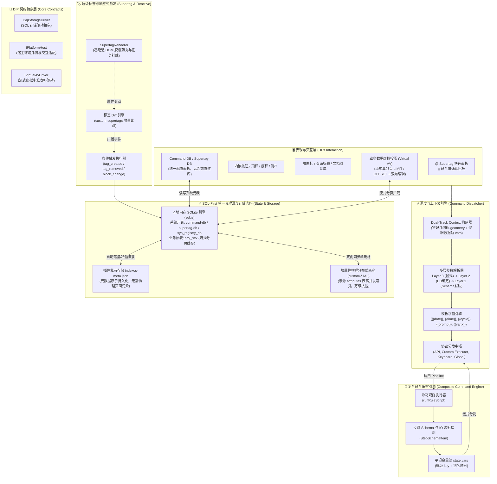
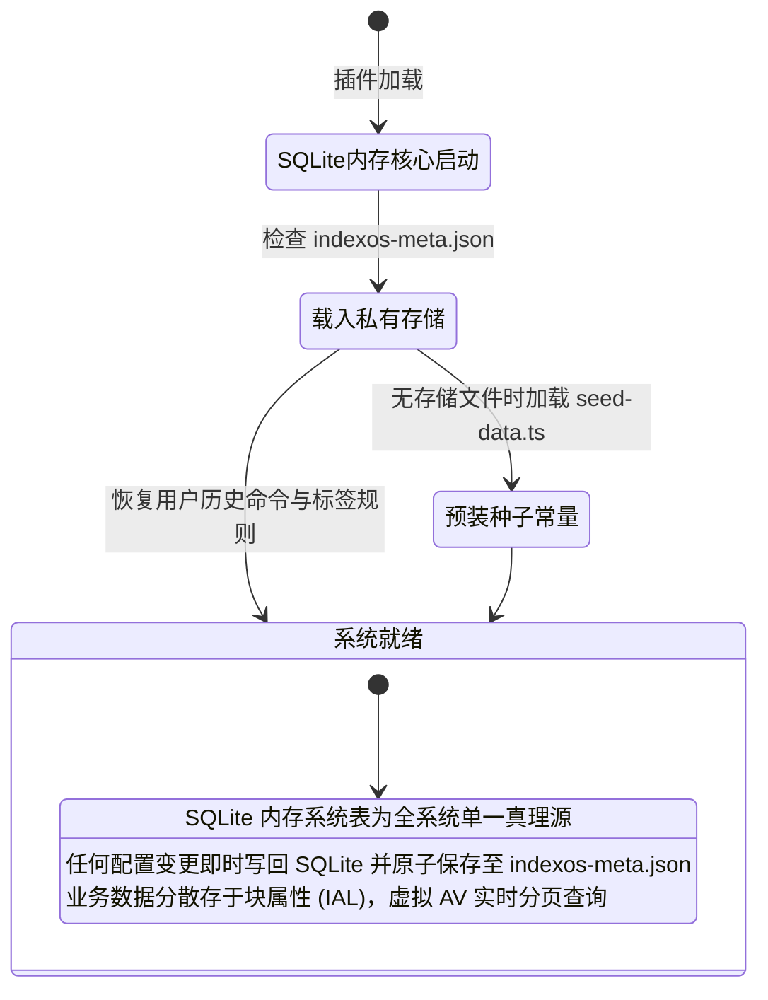

# IndexOS 核心架构与系统数据流规范

> 本文档描述 `siyuan-plugins-index` 与 IndexOS 系统的完整架构规范、分层模型、数据流转与状态机。
> 维护约定：任何涉及状态机、数据源或命令调度的演进，必须同步更新本文档。

---

## 1. 系统全景架构图 (Mermaid Architecture)

---

## 2. 状态机：SQL-First 单一真理源与持久化规范

### 核心准则：
1. **纯净内核，拒绝正文元表污染**：系统核心元表（`command-db` 与 `supertag-db`）彻底移出思源正文，不再在用户的笔记本中强制生成物理 AV 页面，避免数据脆弱性与正文污染。
2. **即开即用与单一真理源**：无论用户是否在思源中建库，内存 SQLite 始终为系统唯一有效真理源。用户在配置面板中添加自定义命令、配置标签规则，立即可用且自动持久化至 `indexos-meta.json`。
3. **物理底座与展示分离 (DIP)**：
   - **物理持久化**：业务数据纯走块属性（`custom-supertags` 与 `custom-${tag}-${field}`），利用思源底层 SQLite `attributes` 表的高效索引，杜绝大 JSON 卡死；
   - **逻辑处理**：本地 SQLite 内存表；
   - **展示交互**：空 AV 壳子拦截渲染，服务端真流式分页（`LIMIT :pageSize OFFSET :offset`）。

---

## 3. 四层架构分层模型 (Four-Tier Hierarchy)

| 层级 | 实体与定义 | 物理真理源 | 逻辑与调度接入 |
|---|---|---|---|
| **Layer 1: 命令定义** | `CommandDef`（ID、参数规范、底层执行协议、目标作用域） | 内置 `builtin/*.json` + 插件注册 | 内存注册表 `commandRegistry` + `sys_registry_db` 表 |
| **Layer 2: 命令分身编排** | `CommandBinding`（Command-DB 行，定义具体分身的默认入参 `Input` 与出参重命名 `Output`） | 插件存储 `indexos-meta.json` | 内存 SQLite `command-db` 系统表 |
| **Layer 3: Supertag 绑定** | `SupertagCommand`（Supertag-DB 行，定义标签关联的菜单按钮 `Manual` 与自动化规则 `Auto`） | 插件存储 `indexos-meta.json` | 内存 SQLite `supertag-db` 系统表 |
| **Layer 4: 业务数据流** | 具有超级标签的实际笔记块及其业务字段（如 Task, Project, Book 属性） | 笔记物理块属性 (IAL) | `proj_${tag}` 虚拟投影表（流式真分页） |

---

## 4. 命令调度与参数流转规范 (Dataflow & Context)

### 4.1 双轨上下文 (Dual-Track Context)
每次命令触发，调度器统一构建双轨上下文：
- **空间物理轨 (Spatial Track)**：自动计算触发节点在视口中的绝对物理几何边界：
  `geometry: { x, y, width, height, centerX, centerY }`，供粒子特效、弹窗悬浮精确定位。
- **逻辑数据轨 (Logical Track)**：包含 `blockId`、`supertag`、`executionMode`（前台/后台）以及动态平坦变量池 `vars: Record<string, unknown>`。

### 4.2 参数解析优先级 (逐键覆盖)
1. **Layer 3 (显式客制化入参)**：调用方显式传入的参数（如 Pipeline 步骤中手动配置的参数或按钮 `?p={}` 参数）；
2. **Auto-Context (上下文自动感应)**：针对 `id` / `blockid` 参数，自动感应前置步骤产出的 Block ID 或当前上下文块 ID；
3. **Layer 2 (Command-DB 绑定默认值)**：数据库中配置的 `Input Mapping`；
4. **Layer 1 (Schema 注册默认值)**：命令元数据 `params[].default`。

### 4.3 纯粹 IO 规范 (Clean Separation of Concerns)
- **输入 (Input)**：由调用方或 Pipeline 统一入参池提供，命令**不回显**输入参数到变量池。
- **输出 (Output)**：命令仅产出真正执行产生的**事实结果**（如新创建的块 ID `createdblock`、API 返回的结构体数据），自动进入平坦变量池供后续步骤以 `{{var.xxx}}` 消费。

---

## 5. 核心模块与目录布局

- **注册表与内置定义**：`src/features/command/registry/` (`command-registry.ts`, `builtin/*.json`)
- **调度中枢与执行协议**：`src/features/command/dispatcher/` (`dispatcher-core.ts`, `param-resolver.ts`, `executors.ts`, `context-builder.ts`)
- **原子执行器**：`src/features/command/effect/` (`visual-effect.ts`, `safe-update-block.ts`, `insert-block-below.ts`, `set-block-attribute.ts`, `add-supertag.ts`, `open-target.ts`, `show-message.ts`)
- **复合命令编排引擎**：`src/features/command/pipeline/` (`engine.ts`, `manager.ts`, `script-dsl.ts`, `pipeline-step-schema.ts`, `PipelineEditorDialog.svelte`)
- **统一属性管理与超级标签 (Unified Attributes & Supertags)**：`src/features/unified-attributes/` (`core/`, `projection/`, `inspector/`, `manager/`, `renderer/`, `suggestion/`)
- **属性视图与配置弹窗**：`src/features/command/av-interaction/` (`command-db-handler.ts`, `type-db-handler.ts`, `dialogs/`)
- **入口注册与菜单挂载**：`src/features/command/global-registration/` 与 `src/features/command/menu-hooks.ts`
- **后台调度与通用工具**：`src/features/command/background/` 与 `src/features/command/utils/`
- **初始化与存储管理**：`src/features/command/indexos/` (`command-sqlite.ts`, `seed-data.ts`), `registration.ts`
