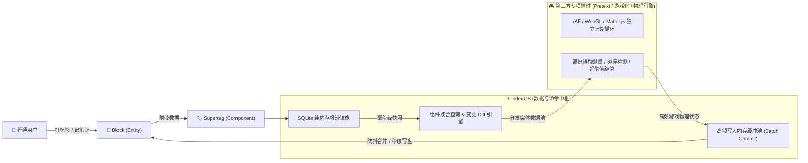
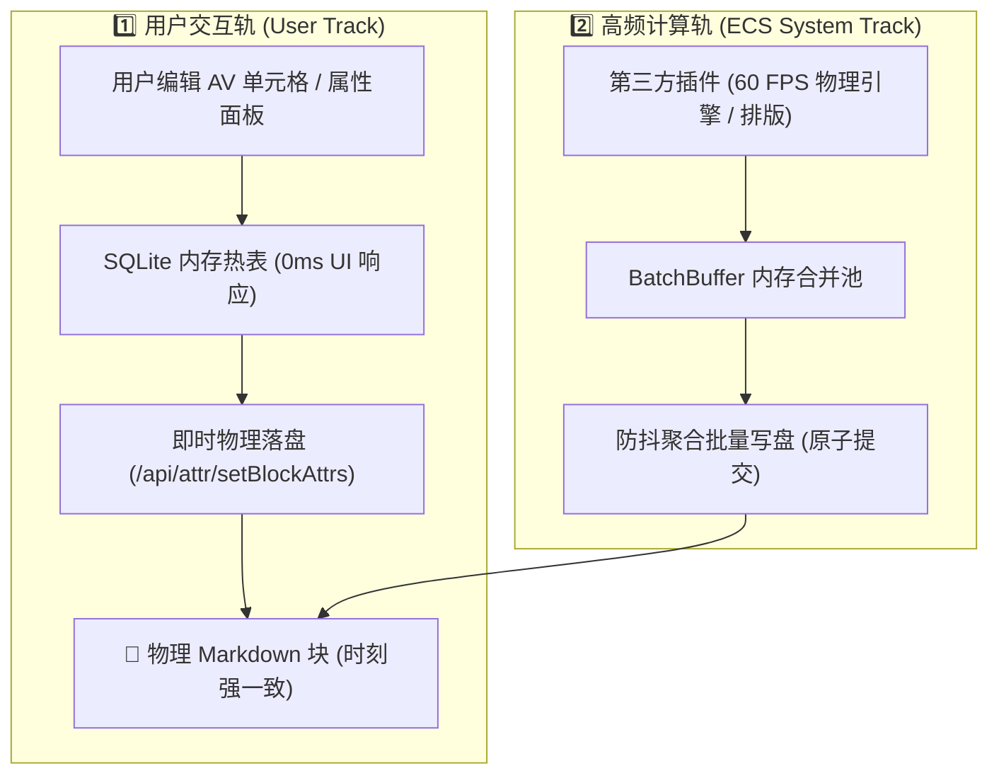

# IndexOS 响应式组件流与批量缓冲池架构蓝图 (ECS Component Store & Batch Buffer)

> **版本**：v1.0 (Draft)  
> **定位**：IndexOS 作为“Entity-Component 数据中枢与命令网关”，为第三方复杂计算插件（如 Pretext 文本排版、PixiJS/MatterJS 游戏化物理引擎）提供高性能组件查询与 I/O 缓冲服务。

---

## 1. 架构定位与三元角色模型

在双链笔记体系下：
* **Entity（实体）**：思源块（`block_id`）或文档（`root_id`）；
* **Component（组件）**：Supertag 与块属性（如 `#monster{hp:100, x:120, y:300}`, `#physics_body{mass:5}`, `#task{status:"pending"}`）；
* **System（系统）**：针对具备特定 Component 组合的 Entity 集合进行高频计算、物理模拟、排版测量或状态聚合的计算逻辑。

### 三元权责边界



1. **普通用户**：享受 Supertag 直觉化交互与卡片属性展现，完全无需接触任何底层计算循环；
2. **IndexOS**：
   - 维护全量 Entity-Component 的 SQLite 纯内存镜像；
   - 提供组件查询网关与变更订阅；
   - 承载高频写操作的防抖合并与批量安全落盘（解决思源 API 无法承受 60 FPS 写入的死穴）；
3. **第三方计算插件（如 Pretext / 游戏化插件）**：
   - 自主拥有独立视图画布（Canvas / WebGL）、渲染循环（`requestAnimationFrame`）或 Web Worker；
   - 作为 System 的实际执行者，专注于算术与渲染。

---

## 2. 核心架构服务设计

### 2.1 极速实体聚合查询 (In-Memory Entity Query)

第三方插件可通过全局 API 毫秒级抓取符合组件条件的实体快照：

```typescript
// 示例：游戏化插件抓取所有具备物理属性且有生命值的实体
const monsters = window.IndexOS.queryEntities({
    all: ["#monster", "#physics_body"], // 必须全部包含
    none: ["#dead"],                    // 排除死亡实体
    select: ["id", "hp", "pos_x", "pos_y", "mass"]
});
```

* **底层支撑**：直接复用 IndexOS 现有的 `_av_schema` 与 `sys_registry_db` SQLite 纯内存缓存，查询耗时 `< 1ms`，零 DOM 开销。

---

### 2.2 响应式组件流订阅 (Component Delta Subscription)

当用户在编辑器中修改内容、打上标签或改变属性时，第三方插件能即时获得增量通知：

```typescript
// 示例：监听任务完成与血量变动
const unsubscribe = window.IndexOS.subscribeComponents({
    tags: ["task", "monster"],
    onChange: (delta: { entityId: string; changedProps: Record<string, any>; event: string }) => {
        // 游戏引擎做出反应：如掉落经验球、播放受击动画
    }
});
```

---

### 2.3 双轨写回与批量缓冲池架构 (Dual-Track Writeback & Batch Buffer)

为了在保证绝对数据一致性的同时支撑高频计算，IndexOS 采用内外分层的双轨写回架构：



1. **用户交互轨（即时强一致）**：
   - 终端用户在虚拟 AV 数据库、属性面板中的离散编辑操作，遵循「内存热表即刻响应 + 块物理 IAL 即时落盘」原则；
   - 彻底向终端用户屏蔽底层回写策略配置，做到真正的开箱即用与所见即所得，杜绝因未保存或延迟引发的数据断层。

2. **高频计算轨（ECS 缓冲保护层）**：
   - 面向第三方计算插件的高频状态流（如 60 FPS 坐标演算、经验值高频累加），由 IndexOS 底层的 `BatchBuffer` 充当硬件 I/O 减震器；
   - 外部系统调用 `window.IndexOS.batchCommit(entityId, deltaProps)`，缓冲池在内存中合并最新状态并按节奏批量落地。

---

## 3. 规划路线图 (Roadmap)

- [ ] **Phase 1 (只读网关)**：对外暴露标准的 `window.IndexOS.queryEntities` API，打通 SQLite 内存镜像读取；
- [ ] **Phase 2 (批量缓冲)**：实现 `BatchBuffer` 内存队列，提供面向第三方系统的高性能防抖批量持久化保护层；
- [ ] **Phase 3 (响应式流)**：打通 Supertag Diff 引擎与对外事件广播通道。
