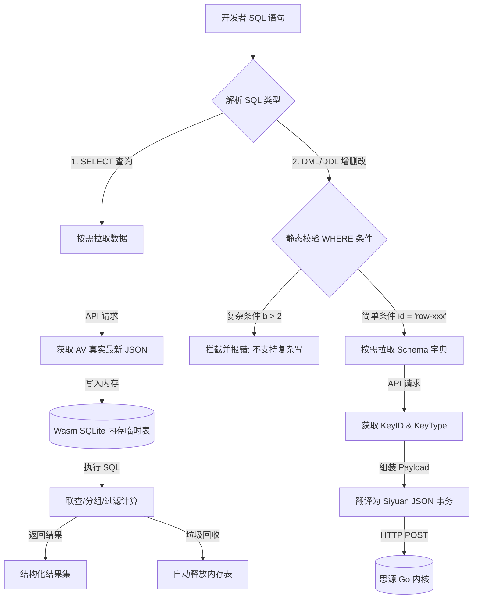

# 思源属性视图（AV）极简 SQL/Database API 架构设计提案 (运行时按需转译方案)

为了解决在 Siyuan 插件开发中“频繁对属性视图（AV）进行增删改查操作时易出错、字段 ID 映射繁琐、API 结构复杂”的痛点，我们在此分析并设计一套标准化的 **AV 写入/变动 API**，允许本插件及其他第三方插件通过极简的 SQL 统一操作思源内置表格。

经过深度论证，为了**彻底规避本地 SQLite 镜像缓存与思源磁盘文件不同步的风险（脑裂问题）**，同时**消灭复杂的后台同步守护代码**，我们决定放弃“全局实例化物理数据库”的设计，采用**“运行时按需转译（On-Demand In-Memory Hybrid）”**模式。

---

## 1. 核心共识：运行时按需转译模式

新架构核心原则为：**读操作临时建表，写操作直接翻译且不建表，不保存物理 SQLite 文件，不运行全局后台同步守护。**



---

## 2. 读写操作的具体技术规范

### A. SELECT 查询操作（仅在搜索时触发临时内存建表）
* **运行机制**：
  1. 当且仅当开发者执行 `SELECT` 语句时，解析层实时发送 HTTP 请求 `/api/av/getAttributeView` 抓取目标属性视图的最新完整数据。
  2. 在 WebAssembly 纯内存中（`sql.js`）临时执行 `CREATE TABLE` 并将数据行 `INSERT` 进去。
  3. 执行 SQL 计算并返回结果。
  4. 立即释放或垃圾回收该内存表。
* **优势**：
  - **100% 数据一致性**：每次查询都实时去思源拿最新数据，完全避免了缓存不同步的 bug。
  - **保留了完整的 SQL 语法威力**：在内存中我们依然拥有全功能 SQLite 引擎，因此完美支持 `JOIN`（需联查表均已拉取）、`GROUP BY`、`ORDER BY`、聚合函数等复杂读操作。
  - **极速响应**：千行级表格的拉取、解析与内存建表在本地 Loopback网络下通常在 **30ms - 100ms** 内完成，对于脚本和检索交互完全无感。

### B. INSERT / UPDATE / DELETE 增删改操作（完全不建表，直接翻译）
* **运行机制**：
  - 写操作**完全不在内存中载入任何行数据或创建临时表**。
  - 解析层将直接读取对应 AV 的字段 Schema（字段名 ➔ `keyID` 映射，仅需几字节网络开销且可做短 TTL 缓存）。
  - 将 SQL 直接正则拆解，转译为思源的单元格 JSON 事务 Payload，直接通过 HTTP 发送给思源 Go 内核。
* **限制与单表写定义**：
  1. **禁止复杂条件写**：仅支持单表简单写，条件必须为固定的 `WHERE id = 'row-xxx'` 或 `WHERE id IN ('row-1', 'row-2')`。
  2. **不支持级联修改和子查询写**：例如 `UPDATE TableA SET x = 1 WHERE id = (SELECT ...)` 将被直接拦截并抛出不支持异常。
  3. **数据类型强制转换**：所有 SQL 类型映射到思源内置字段类型（`TEXT`➔`text`, `BOOLEAN`➔`checkbox` 等）。

---

## 3. 架构对比：全局磁盘镜像 vs. 运行时按需转译

| 维度 | 全局磁盘镜像（旧方案） | 运行时按需转译（新共识） | 优劣势评估 |
| :--- | :--- | :--- | :--- |
| **磁盘占用** | 写入物理文件 `index-os.sqlite` | **0 字节**，完全基于内存和临时变量 | 新方案极其轻量，对思源同步盘无负担 |
| **数据一致性** | 易产生“脑裂”，需复杂的 WS 同步监听 | **100% 绝对一致**，读写均实时对接内核 | 新方案彻底消灭了同步不一致的顽疾 |
| **写操作开销** | 每次都需要将整个 Wasm 数据库持久化到磁盘 | 仅发一条 HTTP API 请求直接回写思源 | 新方案对写操作的磁盘 IO 友好度极高 |
| **读操作速度** | 本地内存执行（< 1ms） | 需要额外拉取一次 AV 数据（30-100ms） | 旧方案略快，但对于千行级数据新方案的延迟完全在可接受范围内 |
| **系统复杂度** | 极高（包含文件读写、WS 监听、数据 Hash 比对） | **极低**（仅包含正则解析和按需 Fetch） | 新方案减负了 60% 以上的代码量，大幅提升稳定性 |

---

## 4. 下阶段落地排期建议

为了尽快落实这一轻量化的极简 SQL API，下阶段开发任务调整如下：

### 📅 开发计划
* **Phase 1 [列名翻译字典构建]**：
  编写轻量级缓存映射，允许在运行时通过 `/api/av/getAttributeViewKeysByAvID` 高速获取表字段映射表，将 `'列名'` 翻译为 `col-xxxx` 列 ID。
* **Phase 2 [纯 API 变动转译层 (DML 写)]**：
  实现 `executeWritableSql` 的正则分支，拦截不符合 `WHERE id = '...'` 的复杂修改。解析符合标准的 `UPDATE/INSERT/DELETE` 并直接将 Payload 提交至思源接口。
* **Phase 3 [内存临时建表与 SELECT 转译 (读)]**：
  实现 `executeReadSql`：每次执行查询时动态请求属性视图 JSON，用 `sql-wasm.js` 在纯内存中动态建表并写入数据，运行 SQL 查询并返回结果，最后自动销毁或垃圾回收内存表。
* **Phase 4 [外部 API 暴露]**：
  将 `window.indexOS.db.executeSql` 注册为全局接口，本插件的诊断面板、逻辑工厂以及其他外部插件均可以通过传入一条 SQL 字符串来进行极简的 AV操作。

---

## 5. Siyuan 原生界面行 ID 获取分析与“主键文本更新”头脑风暴

### ① 用户在思源原生界面是否有办法获取行 ID？
通过研究思源源码及前端交互，我们得出结论：**在思源的属性视图（AV）原生表格界面，普通用户极难直接复制/获取某行的行 ID（即 rowID / BlockID）。**
* Siyuan 属性视图表格中的每一行，本质上绑定了一个文档或块。
* 数据库表格的每一行并没有“右键复制 RowID”的菜单。用户唯一的办法是：
  1. 点击第一列（主键列）的块引用，跳转到对应的块。
  2. 在编辑器里右键该块，点击“复制块 ID”。
  3. 将这个 ID 粘贴到我们的控制台执行更新。
* **结论**：如果写 SQL（DML）只能通过 `WHERE id = 'row-xxx'` 来执行更新，对最终用户的调试体验是非常痛苦且不直观的。

---

### ② 解决方案头脑风暴与对比分析：支持直接填“主键文本”更新

如果我们希望支持类似以下的极简更新语句（使用第一列主键列的文本内容，如 `'🖇️ 复制块引用'`，而不是晦涩的 ID）：
```sql
UPDATE "Command-DB" SET Enable = 0 WHERE id = '🖇️ 复制块引用';
-- 或者更标准地表达：
UPDATE "Command-DB" SET Enable = 0 WHERE label = '🖇️ 复制块引用';
```

我们有以下三种实现方案：

#### 方案一：内存临时建表作为“DML 过滤器” (In-Memory DML Filter)
当解析到 UPDATE 语句，且发现 `WHERE` 条件中的值不是标准思源 ID（即不匹配 `\d{14}-[a-zA-Z0-9]{7}` 格式）时：
1. **内存预解析**：后台实时发送 API 请求拉取该 AV 表格的全量 JSON 数据。
2. **在内存中瞬时建表**：将数据行插入内存 Wasm SQLite。
3. **定位 ID**：运行一个纯粹的 `SELECT rowID, _itemID FROM "Command-DB" WHERE label = '🖇️ 复制块引用'`。
4. **获取行 ID 并提交**：提取出真实的行 ID（如 `20260527105947-ercwhjj`），将其转化为 `id = '2026...'` 的标准写交易发送给思源 Go 内核。

* **对比分析**：
  * **优点**：
    * **能力极强，完全符合标准 SQL 预期**。它不仅支持主键文本精确匹配，甚至支持模糊匹配（`WHERE label LIKE '%复制%'`）和多列复合条件（`WHERE Priority = 'High' AND Enable = 1`）。
    * 统一了读写的核心技术底座（利用内存 SQLite 完成条件筛选）。
  * **缺点**：写操作多出了一次内存装载的过程（约 50ms 延迟），但相比用户体验的巨大提升，这个延迟可以忽略不计。

#### 方案二：纯 JS 进行 JSON 数据过滤查找 (Pure JS Parsing)
当 `WHERE` 条件为文本时，拉取最新的 AV JSON 数据，不在 Wasm SQLite 中建表，而是直接在 JS 代码里用 `Array.prototype.find()` 对行进行扫描：
* 判断某行的 `Block` 列或特定列的 `content` 是否等于 `'🖇️ 复制块引用'`。
* 找到后提取其 `itemID` 和 `rowID`，再提交事务。

* **对比分析**：
  * **优点**：速度较方案一更快，免去了在 Wasm SQLite 中创建表和 INSERT 数据的开销。
  * **缺点**：只适用于非常单一的 `equals`（等值）匹配。一旦用户写出 `LIKE`、`>`、`<` 或者多条件组合（`AND` / `OR`），JS 匹配器就会因为需要手写复杂的条件引擎而变得异常臃肿，失去了通用性。

#### 方案三：限制仅支持调用思源 PrimaryKey 检索 API
调用思源原生的 `/api/av/getAttributeViewPrimaryKeyValues` 接口，传入关键字 `'🖇️ 复制块引用'` 进行搜索，思源会返回匹配到的 `databaseBlockIDs`。

* **对比分析**：
  * **优点**：调用官方现成 API，实现简单。
  * **缺点**：
    * 该 API 是一个“搜索/检索”接口，如果存在类似名称的重名行，会返回多条记录，容易造成更新错乱。
    * 只能用于第一列（主键列），无法支持按其他列（如 `Status`、`Priority`）过滤更新的需求。

---

### 💡 架构师结论与建议

> [!IMPORTANT]
> **结论：方案一（内存临时表作为过滤层）是技术上限最高、未来扩展性最好、且对开发者最友好的方案。**
> 
> 我们将 UPDATE/DELETE 的解析逻辑升级为：
> 1. 解析 `WHERE` 表达式。
> 2. 如果 `WHERE` 的值满足思源 ID 正则，直接打包发送思源 HTTP 请求（极速执行，无内存开销）。
> 3. 如果 `WHERE` 条件包含列名过滤（如 `WHERE label = '🖇️ 复制块引用'`），自动将其作为 `SELECT` 语句先在 Wasm 内存表中运行一遍，筛选出对应的行 ID 数组，然后再转化为思源的原生批量修改事务（`id IN (...)`）发送。
