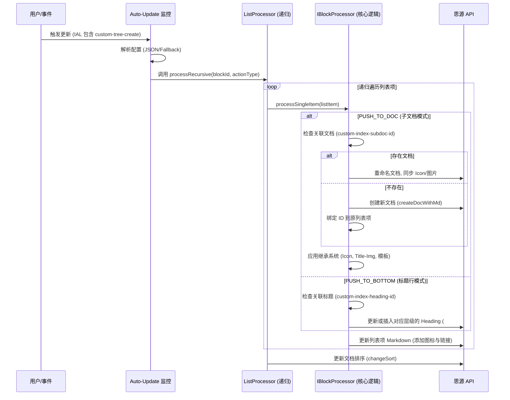

# Builder 功能逻辑详述

`Builder` 模块负责将层级化的列表块（List）转换为结构化的文档架构（子文档树或标题层级）。

## 核心流程图

## 关键逻辑细节

### 1. 内容解析 (Content Parsing)
- **正则表达式提取**：通过 `parseItemContent` 分离列表项中的“文档链接图标”、“分隔符 (➖)”和“实际同步文本”。
- **图标优先级**：属性中的 Icon (AV 数据) > 列表项开头的原生 Emoji > 默认图标 (📄)。

### 2. 属性继承系统 (Inheritance System)
- **强继承 (Strong)**：强制子项与父项保持一致（如分类图标）。
- **弱继承 (Weak)**：仅在子项未设置特定属性时，使用父项的值进行填补。
- **自定义映射**：支持将 AV 中的任意列映射为文档的自定义属性 (`custom-xxx`)。

### 3. 不同场景处理
- **空文档处理**：若目标文档仅包含一个空的段落块，Builder 会在应用模板时自动清理该空块，保持文档整洁。
- **复合模式 (Composite)**：在 `PUSH_COMBINED` 模式下，Builder 会执行双通（Two-Pass）逻辑：先构建底部标题大纲以获取稳定的 ID 索引，再构建子文档树。
- **排序同步**：在构建树结构后，会收集所有子文档路径并调用 `changeSort` API，确保思源侧栏文件树的顺序与列表顺序完全一致。

### 4. 容错逻辑
- **JSON 鲁棒性**：处理 SiYuan 属性中常见的引号转义问题，支持对非标准 JSON 键的自动修复。
- **死循环拦截**：结合 `Data` 模块的 ID 绑定，若内容与属性未发生实际变化，Builder 将跳过昂贵的 API 调用。
