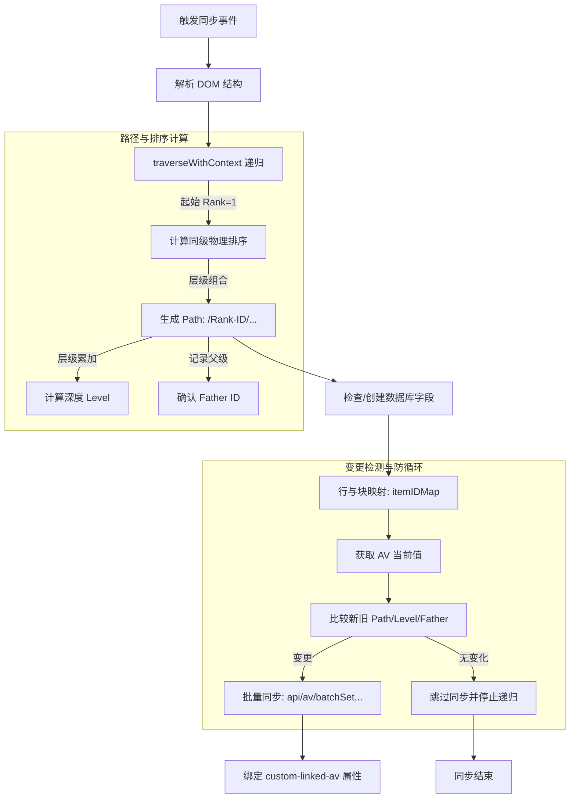

# Data 数据与数据库同步详述

`Data` 模块负责将思源列表块（List）的双向层级关系映射到属性视图数据库（Attribute View, AV）。

## 核心同步逻辑图

## 关键同步逻辑细节

### 1. 物理排序路径 (Rank-Path System)
- **格式解析**：`/001-ID1/002-ID2/...`。每个段包含 3 位数字补零的物理序号，保证在数据库中按字母排序时，其显示顺序与列表视觉顺序完全一致。
- **动态更新**：当列表项在思源内被用户拖动位置并触发更新时，Rank-Path 会被重新计算。

### 2. 数据库特征点处理 (Feature Points)
- **数据库聚焦 (Focus)**：
    *   **原理**：利用 `Path` 的前缀匹配。若要聚焦 ID 为 `X` 的所有后代，数据库会执行包含 `-${X}/` 的模糊筛选。
    *   **特性**：由于路径段包含了 Rank 前缀，简单的 `/ID/` 匹配已无法使用。改为基于 ID 尾匹配及斜杠分隔符的正则表达式匹配。
- **自动同步模式 (Sync Modes)**：
    *   **Level 模式**：同步所有深度相同的项。
    *   **Siblings 模式**：同步所有具有相同 Father ID 的项。
    *   **Descendants 模式**：通过 `Path` 前缀（`startsWith`）同步所有子孙节点。

### 3. 不同情况的处理
- **新老数据库切换**：若用户解绑或重建了数据库，`Data` 模块会自动清除各列表块中过时的 `custom-item-id` 标记，确保不会因引用已删除的 AV 行而导致更新失败。
- **多选创建支持**：不仅支持对一整个列表创建数据库，还支持用户拉选文档中的多个离散列表块，模块会自动将它们归并到同一个 AV 视图并保持其相对顺序。

### 4. 实时更新保护 (Recursive Shield)
- **循环拦截**：为了防止“同步属性 -> 触发文件更新事件 -> 再次同步属性”的死循环，模块内部会在执行 `batchSetAttributeViewBlockAttrs` 前进行严密的**值一致性校验**。
- **异步锁**：同步过程完全采用 `await` 串行执行，确保在大规模文档属性写入时，数据库操作始终在稳定的环境下完成。
