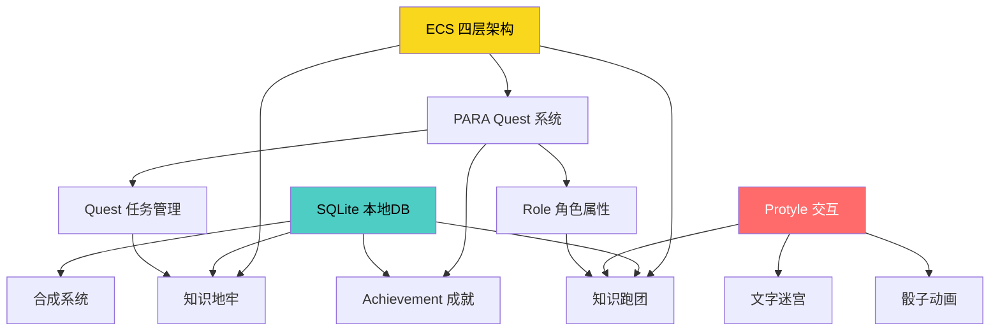

# Gamification Plugin 头脑风暴

> 基于 IndexOS 的 ECS 四层架构与思源笔记本体能力，探索"知识管理 × 游戏化"的可能性。

---

## 〇、技术底座回顾

在开始头脑风暴之前，先明确我们手里有什么"牌"：

### IndexOS 已有能力

| 能力 | 说明 | 游戏化映射潜力 |
|:---|:---|:---|
| **ECS 组件系统** | 块 = Entity，标签 = Component，命令 = System | 角色/物品/技能都可以是"打了特定标签的块" |
| **L2 命令工厂** | 可配置参数的命令变体，支持 TopBar/Slash/Palette | 游戏动作（攻击/使用/装备）可以是命令变体 |
| **L3 类注册表** | 类 → 右键菜单/按钮/生命周期钩子 | 打上 `#Weapon` 标签的块自动获得"装备""强化"按钮 |
| **L4 数据库配置** | AV 列映射、值继承 | 角色属性表、物品属性表直接用 AV 承载 |
| **SQLite 本地数据库** | 脱离思源文档的独立存储 | 存储游戏状态、成就进度、排行榜等高频读写数据 |
| **命令调度器** | 统一的 dispatch 接口 | 所有游戏动作走统一管线，可拦截、校验、记录日志 |

### 思源本体能力

| 能力 | 游戏化映射 |
|:---|:---|
| **块引用 / 嵌入块** | "物品"块可以被引用到"背包"文档中 |
| **属性视图 (AV)** | 天然的数据表 → 角色属性面板、物品数据库、任务列表 |
| **标签系统** | 天然的组件标记 → `#Quest` `#NPC` `#Item` |
| **模板 / 挂件** | 角色卡、状态面板可以用模板生成 |
| **Protyle 富文本** | 文字冒险的叙事载体 |
| **EventBus** | 监听块变更 → 触发游戏事件 |
| **自定义块属性** | `custom-hp`, `custom-level` 等隐藏数据 |
| **SQL 查询** | 全局统计（写了多少字、完成多少任务）→ 成就系统的数据源 |

---

## 一、三种养成与管理系统

### 系统 A：「PARA Quest」—— 任务驱动型知识管理 ⭐

> 与你的原始构思最接近，在此基础上做了结构优化。

#### 核心理念
将 PARA 系统映射为游戏世界的四个维度，每个笔记本不只是文件夹，而是一个独立的"游戏子系统"。

#### 架构映射

| PARA | 笔记本名 | 游戏隐喻 | 核心 ECS 组件 |
|:---|:---|:---|:---|
| **P**roject | 📋 Quests | 任务面板 | `#Quest`, `#MainQuest`, `#DailyQuest` |
| **A**rea | 🧬 Roles | 角色管理 | `#Role`, `#Skill`, `#Trait` |
| **R**esource | 🎒 Inventory | 物品仓库 | `#Item`, `#Consumable`, `#Equipment` |
| **A**rchive | 🏆 Achievements | 成就殿堂 | `#Achievement`, `#Badge`, `#Milestone` |

#### Quest 子系统
- **任务 = 文档页面**：每个任务是一个文档，标题即任务名
- **任务状态**：通过 AV 数据库的"状态"列管理（待接取 → 进行中 → 已完成 → 已归档）
- **任务链**：块引用建立前置任务关系，形成任务树
- **奖励声明**：任务文档中用 `#Reward` 标签的块声明奖励（经验值、物品、成就）
- **自动完成检测**：On Create 钩子检测特定条件（如"今日笔记字数 > 1000"）

#### Role 子系统
- **角色 = 文档页面**，角色属性存储在 AV 中（HP/MP/STR/INT/...）
- **技能树**：用思源的大纲结构天然表达。一级标题 = 技能分支，子标题 = 具体技能
- **技能解锁条件**：通过 `custom-unlock-condition` 块属性存储 JSON 条件
- **ECS 组合**：`#Role` + `#Mage` → 角色获得法师职业的技能树模板

#### 成就子系统
- **成就定义**：每个成就是一个文档，包含条件描述和触发规则
- **统计源**：利用思源 SQL 查询全局数据
  - `SELECT count(*) FROM blocks WHERE type='d'` → "创建了 X 篇文档"
  - `SELECT sum(length) FROM blocks WHERE ...` → "累计写了 X 万字"
- **存储**：成就进度存入 SQLite，避免频繁读写思源文档
- **颁发动画**：达成时用 Dialog API 弹出成就徽章

#### 优势与风险

| ✅ 优势 | ⚠️ 风险 |
|:---|:---|
| 和 PARA 完美对齐，知识管理用户零学习成本 | 四个笔记本结构较重，轻度用户可能觉得麻烦 |
| ECS 天然支持，无需新架构 | 需要大量预设模板才能开箱即用 |
| 成就系统可以利用现有 SQL 能力 | 游戏性主要在管理层面，"玩"的成分较少 |

---

### 系统 B：「Living Document」—— 文档生命体 🌱

> 与你的构思大为不同。不是管理游戏对象（角色/物品），而是让文档本身变成有生命的实体。

#### 核心理念
每一篇笔记文档都是一个"活的生物"。它会成长、会衰老、会需要喂养。你的知识管理行为就是"照料这些生物"的过程。

#### 文档生命周期

```
🥚 Egg（创建）→ 🐣 Baby（< 500字）→ 🌿 Growing（被引用 < 3次）
→ 🌳 Mature（引用 ≥ 3 且有 AV）→ 🏛️ Ancient（> 30天未改且引用 ≥ 10）
→ 💀 Decaying（> 90天未访问）→ 🦴 Fossil（归档）
```

#### ECS 组件设计

| 组件标签 | 自动附加条件 | 效果 |
|:---|:---|:---|
| `#Egg` | 文档创建时 | 显示蛋壳图标 |
| `#Growing` | 字数 > 500 | 显示绿芽图标，解锁"施肥"按钮（添加引用） |
| `#Mature` | 被引用 ≥ 3 | 显示大树图标，开始"产果"（自动推荐相关文档） |
| `#Decaying` | 90天未访问 | 显示枯萎图标，推送通知"这篇笔记需要你的照料" |

#### 数据存储
- **生命状态**：SQLite 表 `doc_lifecycle`（doc_id, stage, birth_date, last_fed, health_points）
- **全局花园视图**：一个特殊的 Dashboard 页面，展示所有文档的生命状态分布
- **健康度计算**：`health = f(引用数, 最近访问, 字数, 标签数)` → 每日定时扫描更新

#### 有趣的互动

- **浇水**：打开一篇文档并编辑 = 浇水，恢复健康值
- **嫁接**：将两篇文档建立双向引用 = 嫁接，两者都获得生长加速
- **收获**：Mature 文档可以"收获"→ 自动生成该文档的摘要卡片到日记中
- **枯萎警告**：Decaying 文档出现在每日 Dashboard 中提醒用户回顾

#### 优势与风险

| ✅ 优势 | ⚠️ 风险 |
|:---|:---|
| 极其新颖，市场上没有类似产品 | 概念较抽象，用户可能不理解"文档是活的" |
| 不需要额外笔记本，感知层面"零侵入" | 需要后台定时扫描计算，性能开销大 |
| 天然激励用户回顾旧笔记 | 游戏元素较弱，更像"可视化仪表盘" |
| Emoji 图标系统已有支持 | 生命周期判定规则需要仔细调优 |

---

### 系统 C：「Forge & Transmute」—— 知识炼金术 🔮

> 完全跳出管理框架。核心玩法不是"管理对象"，而是"合成与转化"。

#### 核心理念
把知识管理比喻为炼金术。你的笔记素材是"原料"，通过特定的"配方"（写作模式），可以将多个低级素材合成为更高级的知识产物。

#### 素材等级体系

| 等级 | 名称 | 思源映射 | 获取方式 |
|:---|:---|:---|:---|
| ⚪ Lv.1 | 碎片 (Fragment) | 单个段落块 | 直接输入 |
| 🟢 Lv.2 | 卡片 (Card) | 一个完整的块（带标签） | 从碎片整理而成 |
| 🔵 Lv.3 | 笔记 (Note) | 一个有结构的文档 | 由多张卡片组织 |
| 🟣 Lv.4 | 文章 (Article) | 长文档（> 3000字 + 引用 ≥ 5） | 由多篇笔记综合写成 |
| 🟠 Lv.5 | 论著 (Opus) | 超长文档或文档树 | 由多篇文章汇聚 |

#### 合成配方系统

```
配方：「观点提炼」
  输入：3 × Card（同标签域）
  输出：1 × Note（自动生成大纲模板）
  副产物：1 × 经验值

配方：「文献综述」
  输入：5 × Note（均含 #Reference 标签）
  输出：1 × Article（自动生成引用矩阵）
  副产物：1 × 成就碎片

配方：「灵感蒸馏」
  输入：任意 10 × Fragment（不限标签）
  输出：随机生成 1 × Card（AI 辅助提取共同主题）
  副产物：惊喜效果
```

#### 技术实现

- **等级判定**：通过 SQL 查询块的字数、引用数、子块数来自动分级
- **合成触发**：用户选中多个块 → 右键"合成" → 检查是否匹配某个配方
- **配方定义**：存储在 SQLite 的 `recipes` 表中，支持用户自定义
- **合成结果**：自动创建新文档，嵌入引用所有输入素材
- **炼金记录**：SQLite 记录所有合成历史，可回溯

#### 优势与风险

| ✅ 优势 | ⚠️ 风险 |
|:---|:---|
| 游戏性极强，有真正的"玩"的感觉 | 概念新颖但可能过于复杂 |
| 天然激励用户从碎片化笔记走向体系化写作 | 配方设计需要大量经验调优 |
| 可以和 AI 结合（灵感蒸馏） | "合成"操作不可逆，需要确认机制 |
| 可扩展性好，未来可以加新配方 | 首次使用引导路径较长 |

---

### 三种系统对比总结

| 维度 | A: PARA Quest | B: Living Document | C: Forge & Transmute |
|:---|:---|:---|:---|
| **与原始构思相似度** | ⭐⭐⭐⭐⭐ 高度相似 | ⭐ 完全不同 | ⭐⭐ 部分重叠 |
| **游戏性** | ⭐⭐⭐ 中等 | ⭐⭐ 偏弱 | ⭐⭐⭐⭐⭐ 极强 |
| **知识管理价值** | ⭐⭐⭐⭐⭐ 极高 | ⭐⭐⭐⭐ 高 | ⭐⭐⭐⭐ 高 |
| **实现难度** | ⭐⭐⭐ 中等 | ⭐⭐ 简单 | ⭐⭐⭐⭐ 较难 |
| **ECS 契合度** | ⭐⭐⭐⭐⭐ 完美 | ⭐⭐⭐ 良好 | ⭐⭐⭐⭐ 很好 |
| **用户进入门槛** | ⭐⭐⭐ 中等 | ⭐ 极低 | ⭐⭐⭐⭐ 较高 |
| **市场独特性** | ⭐⭐⭐ 类似产品存在 | ⭐⭐⭐⭐⭐ 独一无二 | ⭐⭐⭐⭐ 非常新颖 |

**推荐**：以 **A (PARA Quest)** 为主体骨架（稳定、用户熟悉、和现有架构完美兼容），同时将 **C (Forge & Transmute)** 的合成系统作为高阶子模块嵌入。B 可以作为一个轻量化的辅助特性（文档健康度指示器），无需独立笔记本。

---

## 二、五种高交互高游戏性玩法

### 玩法 1：「知识跑团」—— Protyle TRPG Engine 🎲

> 在思源笔记中跑 CoC/DND 风格的桌游角色扮演

#### 概念
将思源笔记变成一个 TRPG (桌面角色扮演游戏) 引擎。文档 = 场景，块 = 叙事单元，角色卡用 AV 管理，骰子引擎内置。

#### 技术实现

```
用户视角：
┌─────────────────────────────────────────┐
│  📖 地下城入口                            │
│                                         │
│  你站在一扇布满苔藓的石门前。             │
│  门上刻着三个符文：🔴🔵🟢               │
│                                         │
│  [检定：智力 DC15] 尝试解读符文           │
│  [检定：力量 DC12] 强行推开石门           │
│  → 返回营地                              │
│                                         │
│  ─── 角色面板 ─────────────────           │
│  ❤️ HP: 24/30  ⚡ MP: 15/20              │
│  🗡️ 武器: 锈蚀短剑 (+2)                  │
│  🛡️ 防具: 皮甲 (AC 12)                   │
└─────────────────────────────────────────┘
```

**核心组件**：

| 组件 | 实现方式 | 说明 |
|:---|:---|:---|
| **角色卡** | AV 数据库 + `#PC` 标签 | STR/DEX/CON/INT/WIS/CHA + HP/MP + 技能列表 |
| **骰子引擎** | Slash 命令 `/roll 2d6+3` | 在当前块下方插入骰子结果块 |
| **检定系统** | Inline Button `[检定：力量 DC12]` | 点击 → 自动 roll → 对比 DC → 输出成功/失败叙事 |
| **场景分支** | 块引用 + 条件跳转 | 成功/失败导向不同的嵌入块（不同文档段落） |
| **战斗系统** | 命令面板 `;;attack` | 读取角色武器属性 → roll 攻击 → 计算伤害 → 更新目标 HP |
| **存档** | SQLite 快照 | 保存当前角色状态 + 场景进度到 SQLite |

**互动亮点**：
- 骰子掷出时有动画效果（CSS animation 在 Protyle 中注入）
- 检定结果用不同颜色块标记（绿色成功 / 红色失败 / 橙色临界）
- 场景文本支持"逐字显示"效果（打字机动画）
- 多人模式：不同角色卡存放在不同文档，GM 在一个文档中统筹

**与 ECS 的结合**：
- `#PC`（玩家角色）、`#NPC`、`#Monster` 都是 L3 类
- 类上绑定的命令不同：PC 有"休息""使用道具"，Monster 有"攻击""逃跑"
- 战利品（Loot）用 `#Item` 标签，打怪后通过 On Create 自动添加到角色背包文档

---

### 玩法 2：「文字迷宫」—— Interactive Fiction Builder 📜

> 利用 Protyle 富文本能力构建交互式文字冒险

#### 概念
不是"玩"现成的游戏，而是一个**创作工具**。用户在思源笔记中用纯文字创建互动小说/文字冒险，然后可以"运行"它。

#### 创作模式 vs 游玩模式

```
创作模式（正常编辑）：
├── 📄 序章
│   ├── 段落1：你醒来发现自己在一间密室中...
│   ├── [选项A → 检查门锁] (链接到文档"密室-门锁")
│   └── [选项B → 查看窗户] (链接到文档"密室-窗户")
├── 📄 密室-门锁
│   ├── 门锁是个三位数密码锁...
│   ├── [输入密码] → 触发验证命令
│   └── [放弃] → 返回序章
└── 📄 密室-窗户
    └── ...

游玩模式（全屏沉浸）：
┌─────────────────────────────────────────┐
│                                         │
│     你醒来发现自己在一间密室中。          │
│     四周的墙壁是冰冷的石头，              │
│     只有一扇紧锁的铁门和一扇高窗。        │
│                                         │
│         ▸ 检查门锁                       │
│         ▸ 查看窗户                       │
│                                         │
└─────────────────────────────────────────┘
```

**技术实现**：
- **创作**：正常的思源文档编辑，用特殊格式标记选项（如 `> [选项: 文本](siyuan://blocks/xxx)`）
- **游玩引擎**：一个全屏 Dialog，解析当前文档的块内容，渲染为沉浸式界面
- **状态变量**：`{flag:hasKey=true}` 存储在 SQLite 中，支持条件分支
- **视觉效果**：CSS 动画（淡入淡出切换场景）、打字机效果、音效触发

**与 ECS 的结合**：
- 场景文档打 `#Scene` 标签 → L3 绑定"运行场景""编辑变量"等命令
- 物品/角色仍用 `#Item` `#NPC` → 在场景中用块引用嵌入
- 支持导出为独立 HTML，分享给非思源用户

---

### 玩法 3：「知识卡牌对决」—— Note Card Battle ⚔️

> 把你的笔记变成卡牌，用知识的力量战斗

#### 概念
每一篇笔记/块都可以被转化为一张"知识卡牌"。卡牌的属性值由笔记的真实质量决定（字数、引用数、结构完整性）。用户可以用自己的知识卡牌与预设的"知识 Boss"或其他用户对战。

#### 卡牌属性计算

```
📇 卡牌：「分布式系统设计」

  ⚔️ 攻击力 = 引用该文档的块数 × 2 = 14
  🛡️ 防御力 = 文档字数 / 500 = 6
  💫 特技 = 标签数量决定：
     - 3+标签 → 「多面手」：攻击时随机加 1~3 点
     - 含 #Code 标签 → 「代码之盾」：防御 +3
     - 含 #Review 标签 → 「反复锤炼」：HP +5

  ❤️ HP = 基础10 + (子标题数 × 2) = 18
  ⭐ 稀有度 = f(总质量分) → ⚪普通 🟢精良 🔵稀有 🟣史诗 🟠传说
```

**对战系统**：
- **回合制**：双方各出一张卡，比较攻击 vs 防御
- **特技触发**：满足条件时自动触发（增添不确定性）
- **组合技**：同时出两张相同标签的卡 → 触发 Combo
- **Boss 战**：预设的"知识 Boss"（如"低效率之王""拖延症巨龙"），属性固定但需要战略

**技术实现**：
- 卡牌数据：通过 SQL 即时计算（`SELECT count, length, ...`）
- 对战引擎：全屏 Dialog + Svelte 组件
- 战斗记录：SQLite 存储战绩
- 奖励：击败 Boss 解锁成就，获得装饰性徽章

---

### 玩法 4：「时间旅行者」—— Temporal Knowledge Quest ⏰

> 利用思源的版本历史与时间线，创造时间穿越式的知识回顾体验

#### 概念
把用户过去的写作历史变成可探索的"时间线世界"。用户扮演"时间旅行者"，穿越到过去的某一天，发现当时写的笔记，完成与之相关的挑战任务。

#### 玩法循环

```
每日登录 → 时间裂缝出现 ──→ 选择一个时间碎片
                              │
                              ▼
                        穿越到过去某天
                              │
                              ▼
                     发现当天写的笔记
                              │
                  ┌───────────┼───────────┐
                  ▼           ▼           ▼
              回顾任务    补完任务    连接任务
           "重读并标注"  "补充内容"  "与今日笔记
                                    建立引用"
                  │           │           │
                  └───────────┴───────────┘
                              │
                              ▼
                       获得时间碎片奖励
                     累计碎片 → 解锁时间线全景图
```

**技术实现**：
- **时间碎片**：随机选取用户 N 天前的一篇文档（SQL 按 `created` 筛选）
- **任务生成**：根据文档状态自动生成：引用少 → "连接任务"；内容短 → "补完任务"
- **时间线视图**：用 Mermaid gantt 或自定义 Svelte 组件渲染写作时间线
- **"蝴蝶效应"**：修改旧笔记后，系统检测是否影响了其他引用它的文档 → 触发连锁事件

---

### 玩法 5：「知识地牢」—— Dungeon of Forgotten Notes 🏰

> 将你的旧笔记、碎片笔记变成需要"攻略"的地下城关卡

#### 概念
系统自动扫描用户的知识库，找出"被遗忘的笔记"（长期未访问、无引用、碎片化内容），将它们组织成一个"地下城"的关卡。用户通过"整理笔记"的行为来"攻略地牢"。

#### 地牢生成规则

```
扫描条件 → 地牢类型映射：

条件                         → 地牢类型           → 攻略方式
━━━━━━━━━━━━━━━━━━━━━━━━━━━━━━━━━━━━━━━━━━━━━━━━━━━━━━━
> 30天未访问的文档             → 「遗忘之厅」       → 重新阅读并添加标签
无任何引用的孤岛文档           → 「孤岛迷宫」       → 与其他文档建立引用
< 100字的碎片笔记             → 「碎片矿洞」       → 扩充内容或合并到其他笔记
标签 > 5 但无 AV 的混乱文档   → 「混沌深渊」       → 整理标签、加入数据库
有 TODO 但未完成的文档         → 「未竟之塔」       → 完成或关闭 TODO
```

**关卡系统**：
- **探索**：查看概览（地牢中有多少笔记、类型分布）
- **战斗**：打开随机一篇，执行整理操作 = "攻击怪物"
- **Boss 层**：最旧/最混乱的那篇笔记是 Boss，需要深度整理
- **奖励**：每清理一层获得经验，经验累计解锁"知识考古学家"等称号
- **排行榜**：SQLite 记录"已攻略楼层数"、"总整理笔记数"

**视觉呈现**：
- 地牢地图：用 Svelte 渲染的简单 2D 地图（每个房间代表一篇待整理的笔记）
- 角色在地图上移动（点击房间 → 打开对应笔记）
- 整理完成后房间变为"已解锁"状态（亮色）

---

### 五种玩法对比总结

| 维度 | 1: 知识跑团 | 2: 文字迷宫 | 3: 卡牌对决 | 4: 时间旅行者 | 5: 知识地牢 |
|:---|:---|:---|:---|:---|:---|
| **游戏性** | ⭐⭐⭐⭐⭐ | ⭐⭐⭐⭐ | ⭐⭐⭐⭐⭐ | ⭐⭐⭐ | ⭐⭐⭐⭐ |
| **知识管理价值** | ⭐⭐ | ⭐⭐ | ⭐⭐⭐ | ⭐⭐⭐⭐⭐ | ⭐⭐⭐⭐⭐ |
| **实现难度** | ⭐⭐⭐⭐⭐ 高 | ⭐⭐⭐⭐ 较高 | ⭐⭐⭐ 中等 | ⭐⭐ 简单 | ⭐⭐⭐ 中等 |
| **ECS 利用度** | ⭐⭐⭐⭐⭐ | ⭐⭐⭐⭐ | ⭐⭐⭐ | ⭐⭐ | ⭐⭐⭐⭐ |
| **用户黏性** | ⭐⭐⭐⭐⭐ | ⭐⭐⭐ | ⭐⭐⭐⭐ | ⭐⭐⭐⭐ | ⭐⭐⭐⭐⭐ |
| **Protyle交互** | ⭐⭐⭐⭐ 深度 | ⭐⭐⭐⭐⭐ 极深 | ⭐⭐ 弱 | ⭐⭐⭐ 中等 | ⭐⭐⭐ 中等 |
| **独立可玩** | ✅ 可独立 | ✅ 可独立 | ❌ 需大量笔记 | ❌ 需历史数据 | ❌ 需积累笔记 |
| **多人潜力** | ⭐⭐⭐⭐⭐ | ⭐⭐⭐ | ⭐⭐⭐⭐ | ⭐ | ⭐⭐ |

---

## 三、综合推荐方案

### 🏆 推荐路线：分阶段递进

```
Phase 1 (MVP)                    Phase 2 (核心玩法)              Phase 3 (高级玩法)
─────────────                    ──────────────                  ──────────────
系统 A: PARA Quest               玩法 5: 知识地牢                 玩法 1: 知识跑团
  └── Quest 任务管理                └── 自动扫描+关卡生成            └── 骰子引擎
  └── Role 角色基础属性              └── 整理笔记=攻略                └── 检定系统
  └── Achievement 成就              └── 经验和称号                   └── 战斗系统
                                                                  
+ 系统 C 的合成子模块              + 玩法 4: 时间旅行者             + 玩法 2: 文字迷宫
  └── 素材分级                       └── 回顾挑战                    └── 创作工具
  └── 基础合成配方                    └── 时间碎片奖励                └── 游玩引擎
```

### 推荐理由

1. **Phase 1** 选择系统 A 因为它和现有 IndexOS ECS 架构**完美兼容**，几乎不需要新架构，只需要定义新的 Component 类和预设模板。合成系统增加趣味性。

2. **Phase 2** 选择知识地牢和时间旅行者，因为它们真正利用了笔记软件的独有优势——**用户已有的数据就是游戏内容**。这是其他游戏化工具无法复制的护城河。

3. **Phase 3** 的 TRPG 和文字迷宫是"重型"玩法，需要大量 UI 工作。但一旦完成，它们的**独特性和传播性极高**（想象一下："我在笔记软件里跑团"的社交传播力）。

### 技术依赖关系



---

*Last Updated: 2026-04-11*
