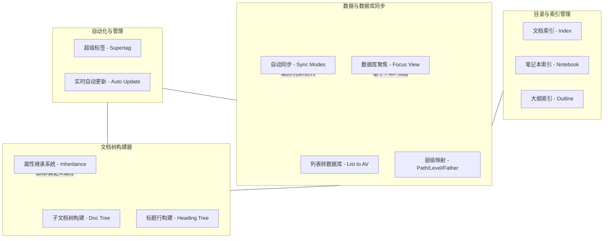

# Index Plugin 项目功能架构

本文档归纳了 `siyuan-plugins-index` 插件的核心功能模块及其逻辑关系。

## 核心功能架构图

## 功能模块详述

### 1. 目录与索引 (TOC Management)
*   **文档索引 (Index)**：在文档顶部或指定位置插入当前文档的目录（通常以列表形式展示）。
*   **笔记本索引 (Notebook)**：跨文档生成整个笔记本的目录结构。
*   **大纲索引 (Outline)**：基于文档内的标题（Heading）层级生成动态大纲。

### 2. 数据与数据库同步 (Data Integration)
*   **真理源同步 (Source of Truth)**：通过解析列表块（List Block）的 DOM 结构，将其双向绑定到思源数据库（Attribute View）。
*   **自动化层级字段**：
    *   `Path`：存储带物理顺序（Rank）的完整路径（如 `/001-ID1/002-ID2`），支持精确的视觉排序。
    *   `Level`：自动计算节点的嵌套深度。
    *   `Father`：自动匹配父级块 ID。
*   **数据库聚焦 (Focus)**：支持一键筛选数据库视图，仅显示选定块的“后代项”或“同级项”。
*   **结构化同步**：支持按“同级”、“同级别”或“所有后代”进行批量属性同步。

### 3. 文档树构建器 (Builder)
*   **子文档构建**：将列表项内容垂直拉取并创建为独立的 `.sy` 子文档，实现从“列表”到“文件夹/文档树”的形态转变。
*   **标题行构建**：将列表转换为文档底部的标题大纲层级。
*   **高级继承系统**：
    *   子文档可自动继承父节点的图标（Icon）、题图（Title-Img）及其他用户定义的属性。
    *   支持“强继承”与“弱继承（仅在空白时填补）”模式。

### 4. 自动化与智能管理 (Smart Automation)
*   **超级标签 (Supertag)**：监控全局事件，当用户为块添加特定标签（如 `#Type#`）时，自动将其捕获并加入到预设的数据库中。
*   **实时自动更新**：
    *   监听文档编辑事件。
    *   当列表内容、顺序或图标发生变化时，自动触发后台同步，保持数据库、索引和构建后的文档树高度一致。
    *   具备**变更检测机制**，避免无效更新导致的界面卡死。

---
*Last Updated: 2026-03-03*
