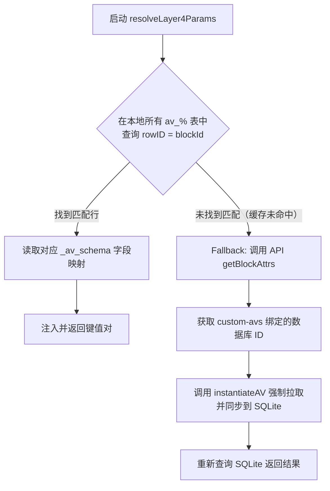

# SQLite 数据库同步与四层（Layer 4）读取标准化更新计划

为了保证思源笔记内置数据库（Attribute View）数据读写的**实时性、准确性**，并最大化减少 HTTP API 请求以太提升性能，我们制定以下重构与演进计划。

---

## 1. 痛点分析与改进方向

### 痛点 1：本地 SQLite 缓存数据失效（数据不同步）
* **现状**：`sqlite-manager.ts` 中的 `_computeDataHash` 只对列定义和行数计算哈希，**完全忽略了单元格的具体数值**。这意味着在思源中直接修改某个单元格（如把任务状态从“待办”改为“进行中”）后，哈希检测依然判定“没有变化”，导致 SQLite 跳过更新，产生过期脏数据。
* **改进**：重构哈希计算函数，将所有单元格的值（如文本、数字、选项、关联等内容）都纳入哈希范围。

### 痛点 2：高频读取时的 API 开销与卡顿
* **现状**：每次触发 Layer 4 占位符解析（`resolveLayer4Params`）时，都会经历 Siyuan `getBlockAttrs` 和 `getAttributeView` API 的 HTTP 轮询，这造成了大量的延迟（数秒级），并且完全背离了“SQLite 作为高速缓存”的初衷。
* **改进**：构建**单向被动同步**。只有在缓存未命中时才进行按需同步，日常查询 100% 走本地 SQLite。

---

## 2. 具体重构方案

### 方案 A：WebSocket 驱动的活性数据库增量同步
我们在插件生命周期的 WebSocket 监听器中，除了监听系统表外，还应当监听用户数据库的变化：

1. **缓存活性视图 Set**：在内存中维护一个已实例化在 SQLite 的 `instantiatedAvIds` 集合。
2. **WebSocket 监听**：当收到 `transaction`、`database` 相关的 WS 更新广播，且携带的 `avID` 存在于集合中时，加入防抖队列。
3. **静默同步**：在后台自动执行 `instantiateAV(avId, true)`。当用户在思源界面对数据进行任何修改时，本地 SQLite 都会在 1.5 秒内自动对齐最新状态，无需人工刷新。

### 方案 B：重构 `_computeDataHash`（精确变更检测）
更新数据校验指纹计算方式，确保任何单元格内容的编辑都能被哈希捕获：

```typescript
function _computeDataHash(keyValues: any[]): string {
    let hash = 0;
    const dataToHash = keyValues.map(kv => {
        return {
            id: kv.key.id,
            name: kv.key.name,
            type: kv.key.type,
            // 抓取并串联所有行的数据值
            values: kv.values?.map((v: any) => {
                const cellVal = v.text?.content || 
                                v.number?.content || 
                                v.checkbox?.checked || 
                                v.date?.content || 
                                JSON.stringify(v.mSelect || v.mAsset || v.relation || []);
                return {
                    blockID: v.blockID || "",
                    content: cellVal
                };
            })
        };
    });
    const str = JSON.stringify(dataToHash);
    
    // 生成哈希值...
    for (let i = 0; i < str.length; i++) {
        const char = str.charCodeAt(i);
        hash = ((hash << 5) - hash) + char;
        hash |= 0;
    }
    return hash.toString(36);
}
```

### 方案 C：标准化 Layer 4 命令参数 SQL 读取流
重构 `resolveLayer4Params`。让它采用 **“本地 SQLite 优先 -> 缓存未命中 fallback”** 的流程，达到零延迟读取：



1. **极速读取**：由于数据已被方案 A 静默同步，多数情况下直接执行 `SELECT *` 即可查到块 ID。耗时小于 5ms，API 请求数为 0。
2. **防爆兜底**：如果在 SQLite 中未检索到此物理块（如刚刚移动或新建的块），则去拉取属性中的 `custom-avs`，强制拉取，并完成补齐。

---

## 3. 后续开发排期 (Roadmap)

*   **第 1 阶段**：修复 `_computeDataHash` Bug，确保哈希对任何单元格修改敏感。
*   **第 2 阶段**：扩展 `top-bar.ts` 中的 WebSocket 同步检测，加入 `instantiatedAvIds` 的全局感知，完成被动后台更新。
*   **第 3 阶段**：重写 `resolveLayer4Params` 查询算法，全面切换为“SQL 优先”读取，移除高频的 HTTP API 前置轮询。